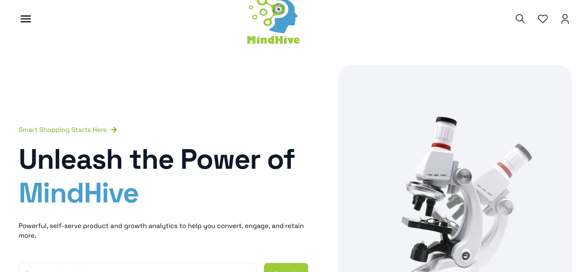

About MindHive

   
      
    </a>
   

🎗️ MindHive Home Page

🔰 **Navigation Bar**: A responsive side navigation menu for easy access to all sections.

🔰 **Header with Carousel**: An eye-catching header featuring a carousel to highlight key features and benefits.

🔰 **Flash Sale**: Display of products currently on sale, along with countdown timers showing time remaining until the sale expires.

🔰 **Our Services**: An overview of the services MindHive provides, presented in a clean and organized layout.

🔰 **Featured Products**: A curated selection of 16-20 products, each with detailed information and visuals to help users make informed choices.

🔰 **Testimonials**: Client reviews of MindHive, displayed in a beautiful carousel format to showcase customer satisfaction.

🎗️Technologies

- Next.js
- Typescript
- Tailwind CSS
- React Icon
- Swiper slider

